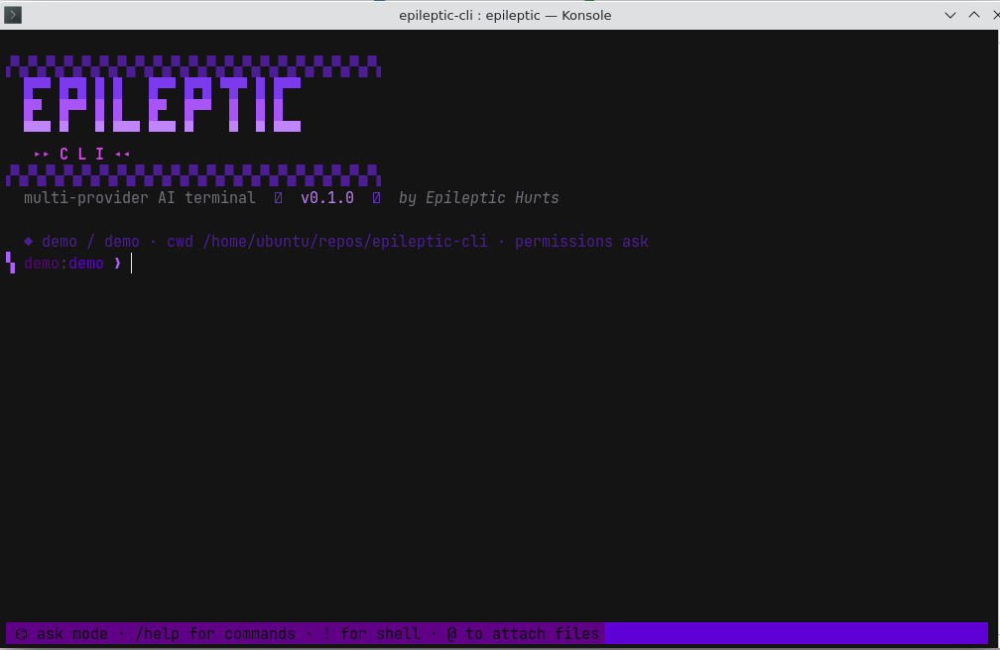
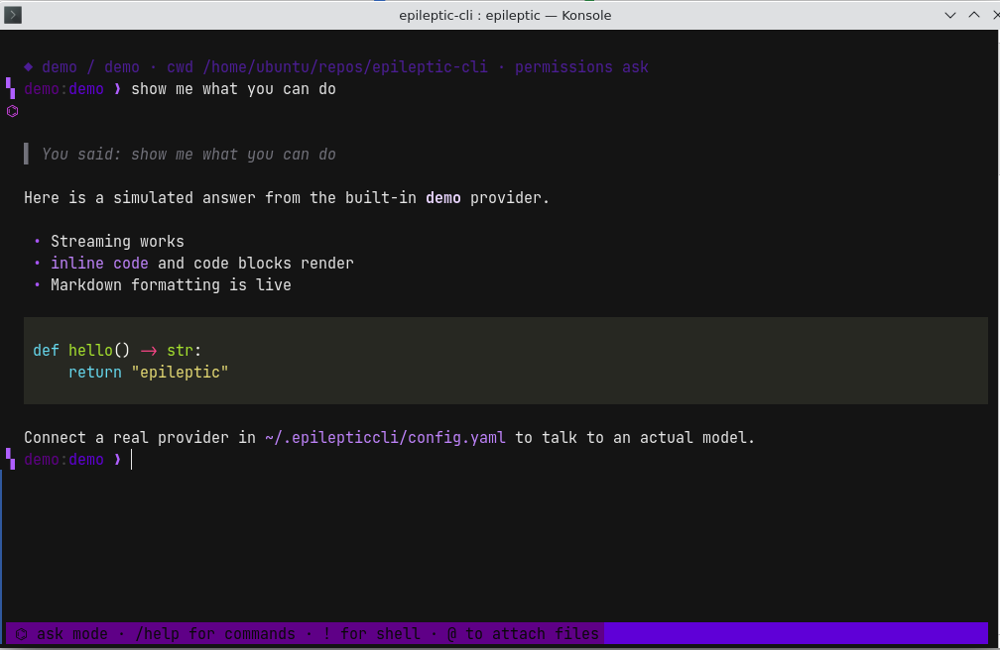

<div align="center">

```
▞▚▞▚▞▚▞▚▞▚▞▚▞▚▞▚▞▚▞▚▞▚▞▚▞▚▞▚▞▚▞▚▞▚▞▚▞▚▞▚▞▚
  █▀▀ █▀█ █ █   █▀▀ █▀█ ▀█▀ █ █▀▀
  █▀  █▀▀ █ █   █▀  █▀▀  █  █ █
  ▀▀▀ ▀   ▀ ▀▀▀ ▀▀▀ ▀    ▀  ▀ ▀▀▀
   ▸▸ C L I ◂◂
▞▚▞▚▞▚▞▚▞▚▞▚▞▚▞▚▞▚▞▚▞▚▞▚▞▚▞▚▞▚▞▚▞▚▞▚▞▚▞▚▞▚
```

**A multi-provider AI terminal client with deep system-prompt control.**

black + violet · streaming markdown · tools · agents · raw prompt mode

by **Epileptic Hurts** · MIT License · English (US)




</div>

---

EpilepticCLI is an interactive, agentic AI client for your terminal — in the spirit of
Claude Code and Kimi CLI, but provider-agnostic and built for people who want total
control over what goes into the model's system prompt.

- **Every provider** — OpenAI, Anthropic, Gemini, OpenRouter, DeepSeek, Groq, Together,
  Mistral, xAI, Ollama, LM Studio… and **any reseller** with an OpenAI-compatible
  endpoint via a custom `base_url`.
- **Deep prompt control** — layered system prompts (built-in → agent file → project
  memory `EPIC.md`/`AGENTS.md`/`CLAUDE.md` → personal override → CLI flag), plus a
  **raw mode** that sends *exactly* your prompt and nothing else — made for
  prompt-engineering and red-team experiments.
- **Agent definitions in markdown** — `.md` files with YAML frontmatter that pin a
  prompt, a model, a provider, and a tool whitelist.
- **Real tools** — file read/write/edit (with diff preview), shell, grep/glob,
  web fetch, and permission modes (`ask` / `auto`, per-tool "always allow").
- **Sessions** — saved transcripts (JSONL), `/resume`, `/export` to markdown,
  `/compact` context summarization, `/cost` token tracking.
- **Feels right** — streaming markdown rendering, slash commands, `!` shell escape,
  `@file` attachments, completion + history, and a black-and-violet theme
  with a glyph-heavy visual identity.

## Install

Requires **Python 3.10+**. Works on Windows 11, Linux, and macOS.

```powershell
# recommended: isolated install
pipx install epilepticcli

# or
pip install epilepticcli

# from source
git clone https://github.com/Makedonskiyy/epileptic-cli
cd epileptic-cli
pip install -e .
```

> **Windows 11 tip:** use Windows Terminal for full Unicode glyph + color support.
> If glyphs render as boxes, set a font like *Cascadia Code* / *JetBrains Mono*
> and run `chcp 65001` (UTF-8) first.

## Quick start

```powershell
# set a key for the provider you want (PowerShell example)
$env:OPENAI_API_KEY = "sk-..."
epileptic

# or pick another provider/model on launch
epileptic --provider anthropic --model claude-sonnet-4-5
epileptic --provider openrouter --model anthropic/claude-sonnet-4.5
epileptic --provider ollama --model llama3.3

# try the UI with zero keys - built-in offline provider
epileptic --provider demo --model demo

# one-shot mode for scripts/pipes
epileptic -p "explain this repo" 
```

Inside the REPL: `/help` for commands, `! cmd` to run shell, `@file` to attach files.

## Providers

Presets (`/providers` lists them live, including key status):

| name | type | env key | notes |
|---|---|---|---|
| `openai` | openai | `OPENAI_API_KEY` | api.openai.com |
| `anthropic` | anthropic | `ANTHROPIC_API_KEY` | native Messages API + tools |
| `gemini` | openai | `GEMINI_API_KEY` | Google's OpenAI-compat endpoint |
| `openrouter` | openai | `OPENROUTER_API_KEY` | one key, every model |
| `deepseek` | openai | `DEEPSEEK_API_KEY` | |
| `groq` | openai | `GROQ_API_KEY` | |
| `together` | openai | `TOGETHER_API_KEY` | |
| `mistral` | openai | `MISTRAL_API_KEY` | |
| `xai` | openai | `XAI_API_KEY` | Grok |
| `ollama` | openai | – | localhost:11434 |
| `lmstudio` | openai | – | localhost:1234 |
| `demo` | demo | – | offline, for testing the UI |

**Resellers / custom endpoints:** any provider of type `openai` accepts a `base_url`,
custom headers, and its own key — add it in `~/.epilepticcli/config.yaml`:

```yaml
providers:
  - name: my-reseller
    type: openai
    base_url: https://reseller.example.com/v1
    api_key: $MY_RESELLER_KEY          # "$NAME" reads an env var
    models: [gpt-4o, claude-sonnet-4-5]
    default_headers: { "X-Custom": "value" }
```

Then: `epileptic --provider my-reseller --model gpt-4o`.

## Configuration

Everything lives in `~/.epilepticcli/` on every OS:

```
~/.epilepticcli/
  config.yaml          # defaults + provider entries (see examples/config.yaml)
  system_prompt.md     # personal system-prompt layer, appended every session
  agents/*.md          # your agent library
  sessions/*.jsonl     # transcripts
  history              # input history
```

```yaml
default_provider: openai
default_model: gpt-4o
permission_mode: ask        # ask | auto
builtin_system_prompt: true # false = raw mode (only your layers)
max_tool_rounds: 40
```

## Agents

An agent is a markdown file with YAML frontmatter. Drop it in
`~/.epilepticcli/agents/` (global) or `.epilepticcli/agents/` (project):

```markdown
---
name: researcher
description: read-only research agent
provider: openrouter            # optional
model: anthropic/claude-sonnet-4.5
tools: [read_file, ls, glob, grep, web_fetch]
---

You are a research agent. You investigate and report; you never modify files.
Cite every claim with a file path or URL.
```

Activate: `/agent researcher` or `epileptic --agent researcher`.
Tool whitelists are enforced — `tools: []` means a pure-chat agent with no tools.

## System prompts — the layered model

`/system show` prints the exact text the model receives. Layers merge in order:

1. **Built-in prompt** — skipped entirely in raw mode
2. **Active agent** body (the `.md` after frontmatter)
3. **Project memory**: `EPIC.md`, `AGENTS.md`, `CLAUDE.md` in the cwd
4. **Personal override**: `~/.epilepticcli/system_prompt.md` (`/system edit`)
5. **Per-launch extra**: `--system-prompt` / `--system-prompt-file`

```powershell
/system raw on        # send ONLY layers 2-5 - nothing you didn't write
/system edit          # edit layer 4 in $EDITOR
/system clear         # remove layer 4
epileptic --raw-system --system-prompt-file payload.md
```

Raw mode is what you want for precise prompt experiments: the wire content is
byte-for-byte your layers, with no hidden prompt additions.

## Commands

| command | what it does |
|---|---|
| `/help` | command list |
| `/model [name]` | show / switch model |
| `/provider [name]`, `/providers` | switch / list providers + key status |
| `/system show\|edit\|raw\|clear` | inspect and control the system prompt |
| `/agent [name]`, `/agents` | switch / list agents |
| `/init` | scaffold `EPIC.md` + example agent in the cwd |
| `/clear` | drop history (keep system prompt) |
| `/compact` | summarize history into context |
| `/export` | transcript → markdown |
| `/sessions`, `/resume <id>` | list / resume saved sessions |
| `/cost` | token usage |
| `/permissions [ask\|auto]` | tool approval mode |
| `/config` | show effective config |
| `/exit` | quit |

## Input tricks

- `! git status` — run shell directly; output is added to context
- `@src/app.py` — attach file contents to your message (autocompleted)
- History + completion for `/commands` and `@files` out of the box

## Tools the model can call

`read_file` · `write_file` · `edit_file` (exact-string edit, diff preview) ·
`ls` · `glob` · `grep` (ripgrep when available, Python fallback) ·
`run_shell` (timeout-guarded) · `web_fetch` (HTML → text).

`write_file`, `edit_file`, and `run_shell` ask for approval in `ask` mode;
answer `a` to always-allow a tool for the session, or run with
`/permissions auto` / `--permission auto`.

## Project status

v0.1 — core REPL, multi-provider streaming, tools, agents, layered prompts,
sessions. On the roadmap: MCP server support, subagent spawning, plan mode,
and plugin hooks.

## License

MIT © Epileptic Hurts
